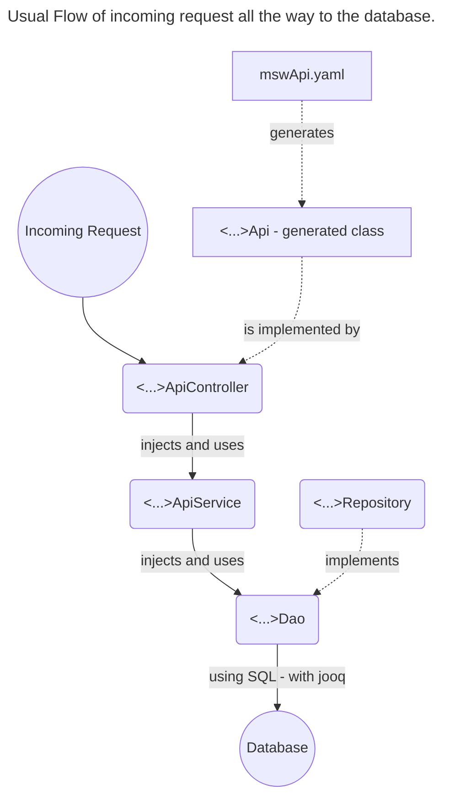

# Backend - From request to Database

You need the mermaid-plugin to see the graphs...

## Structure

## How to change an existing API:
1. Make changes in mswApi.yaml
2. generate backend- and frontend-api
    - using the following gradle tasks:
      - for frontend: "openApiGenerateReact"
      - for backend: "openApiGenerateSpring"
    - Note: Always generate both, otherwise they won't fit together.
3. Check in the generated code and implement your feature :)
4. Deploy backend and frontend together, otherwise the apis won't fit together.